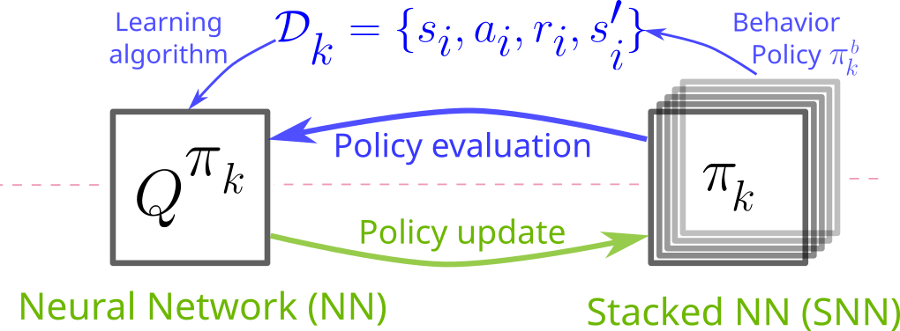
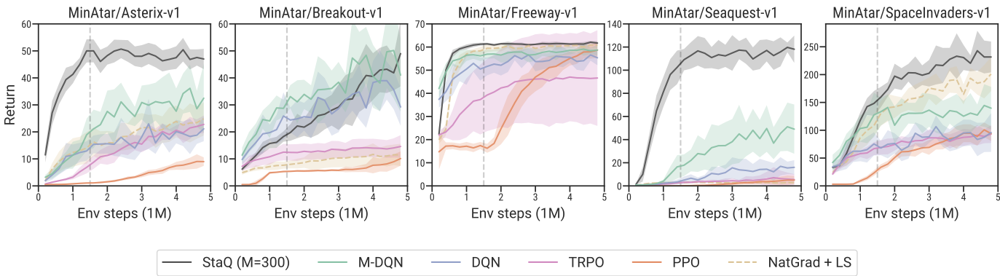

# StaQ: a Finite Memory Approach to Discrete Action Policy Mirror Descent

Official code for the paper accepted at the **Reinforcement Learning Conference (RLC), 2026**.

_Alex Davey, Alena Shilova, Brahim Driss, Riad Akrour_

**Paper:** [RLC (coming soon)](#) | [arXiv](https://arxiv.org/abs/2506.13862)

<p align="center">
  
</p>


StaQ is a finite-memory approach to Policy Mirror Descent (PMD) for discrete action spaces. It retains the last $M$ Q-functions in a stacked neural network, giving an optimization-free policy update that retains PMD's error-averaging effect. In the paper, increasing $M$ improves performance up to a point where finite-memory StaQ closely matches exact PMD.

<p align="center">
  
</p>

## Setup

Create a Python 3.10 Conda environment and install the project dependencies:

```bash
conda create -n staq python=3.10
conda activate staq
pip install -r requirements.txt
```

## Running Experiments

The `run/` directory contains the configurations used for the paper. Each command below takes an environment and seed. For example:

```bash
# Classic control
run/staq_classic.sh CartPole-v1 12345

# MinAtar
run/staq_minatar.sh MinAtar/Asterix-v1 12345
```

These paper scripts run for 5M timesteps. The StaQ memory size $M$ is controlled by `--memory-size` and defaults to $M=300$. The environments benchmarked in the paper are:

```
CartPole-v1
Acrobot-v1
LunarLander-v2
MountainCar-v0

MinAtar/Asterix-v1
MinAtar/Breakout-v1
MinAtar/Freeway-v1
MinAtar/Seaquest-v1
MinAtar/SpaceInvaders-v1
```

## Citations

To cite the paper and/or this repository:

```bibtex
@inproceedings{davey2026staq,
  title     = {StaQ: a Finite Memory Approach to Discrete Action Policy Mirror Descent},
  author    = {Alex Davey and Alena Shilova and Brahim Driss and Riad Akrour},
  booktitle = {Proceedings of the Reinforcement Learning Conference (RLC)},
  year      = {2026}
}
```
